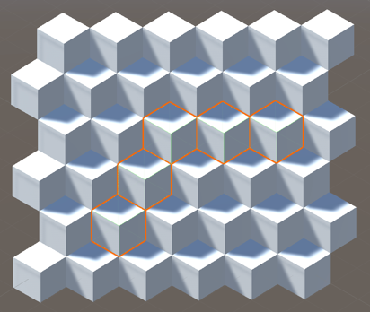

# 六边形地图方案及推论

> 以下方案基于将三维立方体堆叠数据转换为二维平面数据，最终构成的是尖朝上六边形地图。边朝上六边形地图也可得出相似的推论。

一切的想法源自一张立体图：


上图中，每个正方体在屏幕上的投影，都是一个正六边形。所以逆向思考，可以认为六边形地图中的每个六边形，都是一个立方体。
基于此，我们便可以开始进行六边形地图方案的设计与推演。
设计与推演的目的，是能够找到巨象数据与抽象理论之间的关系，以协助我们通过计算机的形式去进行计算。

## 坐标系的建立

### 坐标系的引入思路

既然我们已经将每一个六边形地图巨象成为了一个立方体，那么我们就令这些立方体是边长为1的立方体。基于此，我们便可以给每个立方体定义坐标，并**建立坐标系**。


如上图，建立三维坐标系，其中蓝色为`X`轴，绿色为`Y`轴，红色为`Z`轴。

基于三维坐标系，我们便可以求出每个方块的坐标。比如在上图中，左下方块即可定位为`(5,0,0)`，则右侧方块坐标依次为`(4,0,1)`、`(3,0,2)`、`(2,0,3)`、`(1,0,4)`、`(0,0,5)`。

### 坐标系的确立

那么，让我们将焦点聚焦到最基本的六边形地图转换的立体图上。


如上图，我们可以理解为这是一张二维平面图，每个六边形格子可以用`(x,y)`的形式去表述；同时也可以理解它是一个三维世界的二维投影，每个立方体都可以用`(x,y,z)`的形式去表述。

那么，针对上图中所选立方体，我们将其坐标设为`(0,0,0)`，而其代表的六边形格子的坐标则设定为`(0,0)`。直观地，该点右侧的六边形二维坐标为`(0,1)`，该立方体右侧立方体的坐标为`(1,0,-1)`。

基于此，应用于生产环境的坐标系得以确立，下一步，就是推导该坐标系下的数学规律。

### 坐标系下的运算法则

设某立方体坐标为`(0,0,0)`，那么根据图例，我们可以推导出它周边六个立方体的坐标。

```
以点 (0,0,0) 为基础，
左上角点坐标为   (-1,1,0)，
右上角点坐标为   (0,1,-1)，
右点坐标为      (1,0,-1)，
右下角点坐标为   (1,-1,0)，
左下角点坐标为   (0,-1,1)，
左点坐标为      (-1,0,1)

    (-1,1,0) (0,1,-1)
(-1,0,1) (0,0,0) (1,0,-1)
    (0,-1,1) (1,-1,0)
```

当我们推算出三维坐标系下，原点周围六个点的坐标之后，便可以将这六个点的坐标转换为六个向量，分别表示指定的某个方块周围六个点的**偏移向量**。

---

基于我们是由原点开始构建坐标系，且已获取到六个方向的偏移向量，可以得出以下结论：

**结论1：** 坐标系中所有点的坐标的`x`、`y`、`z`三值之和为0。

*结论1推导：因坐标系以`(0,0,0)`点开始，且各**偏移向量**的`x`、`y`、`z`值之和为0，所以可推导出坐标系中所有点的坐标的`x`、`y`、`z`三值之和为0。*

---

**结论2：** 设坐标系中任意两点的坐标差为`(x,y,z)`，则`x+y+z=0`成立。

*结论2推导：两坐标点的坐标差可以理解为由A点到B点所经过的变换。因该变换由六个方向的偏移向量组成，且六个偏移向量满足`x+y+z=0`，所以该结论成立。*

---

根据数学归纳法，我们可以依据所有点（二维坐标下的六边形，三维坐标下的方块）的二维与三维坐标，求出他们相互之间的转化关系:

**结论3：** 设某点二维坐标为`(a,b)`，三维坐标为`(x,y,z)`，则对任意一点，

存在三维转二维运算：a=x+(y>>1), b=y；

存在二维转三维运算：x=a-(b>>1), y=b, z=-x-y。

---

地图常用的功能之一便是**求取每个点之间的距离**。因为二维坐标不便于我们求取距离，所以我们优先推算每个点在三维坐标下距离的求取方式，之后再利用二维坐标与三维坐标之间的转换关系，即可完成二维左标下求取两点距离的计算流程。

我们先抛出结论：

**结论4：** 设A点与B点三维坐标差为`(x,y,z)`，则该坐标差的本质为6个**偏移向量**中的1-2个各放大不同倍数后叠加而成。

**结论5：** 设A点与B点三维坐标差为`(x,y,z)`，则A点与B点的**距离**为`x`、`y`、`z`中**绝对值的最大值**。

---


我们先选择一个点作为起始点。


之后我们再选择一个点作为目标点。

从起始点到目标点，可以有两种连接方案，如下图实例。




两种方案虽然行走路径不同，但是距离相同。其本质就是`n`个偏移向量的叠加。而由于六边形地图自身的性质，构成两点之间路径的偏移向量，只可能是单独1个向量或相邻的2个向量组合而成。

目光回到**偏移向量**，我们可以发现**任意相邻的2个向量存在一个坐标具有相同的值**，所以结合两点之间路径的偏移向量的本质，就可以得出**结论5**。

